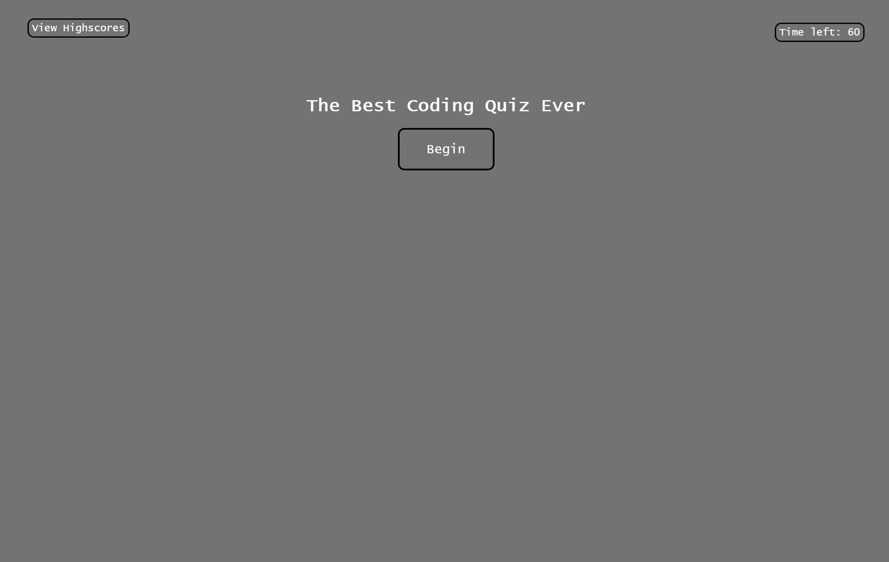
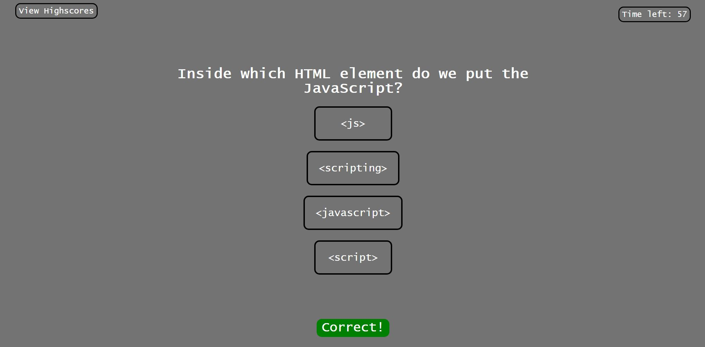
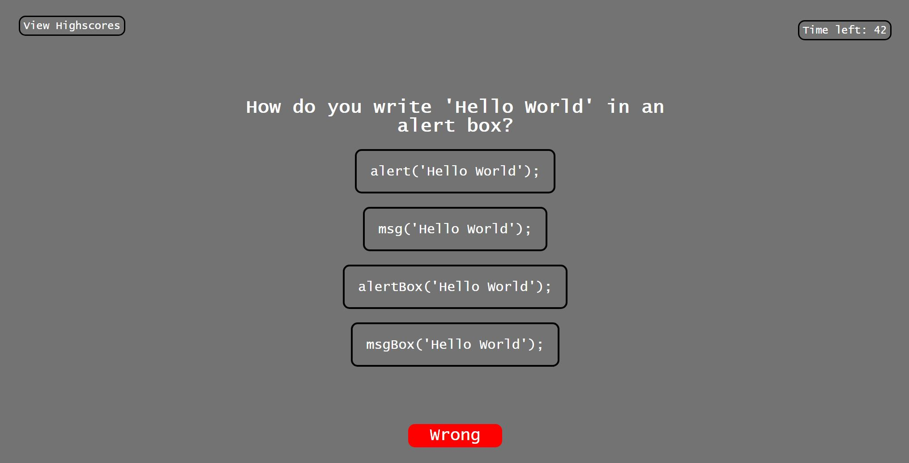

# theBestQuizEver

when the page opens you are presented with a page with the quiz title and a begin button

there is also a view highscores button in the top left and a time left section in the top right

when you click begin, the quiz begins, timer starts and you are presented a question

when you answer the question you are given the next question with a total of 20 questions

when you click the wrong or right question you are given some text stating that it is wrong or right

when the timer ends or you answer all questions you are brought to a page where you enter your initials

when you click submit you are sent to the highscores page, which can also be accessed with the view highscores button

the high scores page is a sorted list of all highscores from previous quiz attempts

there is a go back button that returns you to the quiz and a clear highscores button that will clear all highscores

for quick testing purposes the correct answers are:

3
4
1
2

1
1
3
1

1
2
2
3

2
4
4
1

1
2
2
4

live page: https://zzaclipse.github.io/theBestQuizEver/

